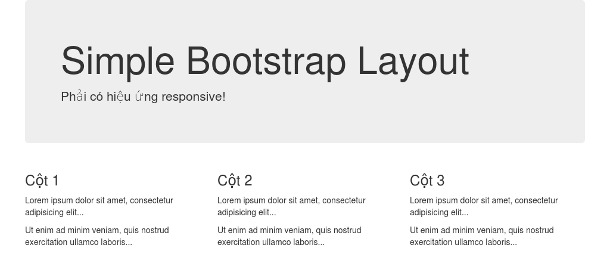

# Simple bootstrap page
- tạo file  ```exercise1.html``` 
- cắt html css theo ảnh sau (phải có ~ responsive)
  
- Nội dung text
```
Simple Bootstrap Layout
Phải có hiệu ứng responsive!

Cột 1
Lorem ipsum dolor sit amet, consectetur adipisicing elit...

Ut enim ad minim veniam, quis nostrud exercitation ullamco laboris...

Cột 2
Lorem ipsum dolor sit amet, consectetur adipisicing elit...

Ut enim ad minim veniam, quis nostrud exercitation ullamco laboris...

Cột 3
Lorem ipsum dolor sit amet, consectetur adipisicing elit...

Ut enim ad minim veniam, quis nostrud exercitation ullamco laboris...
```